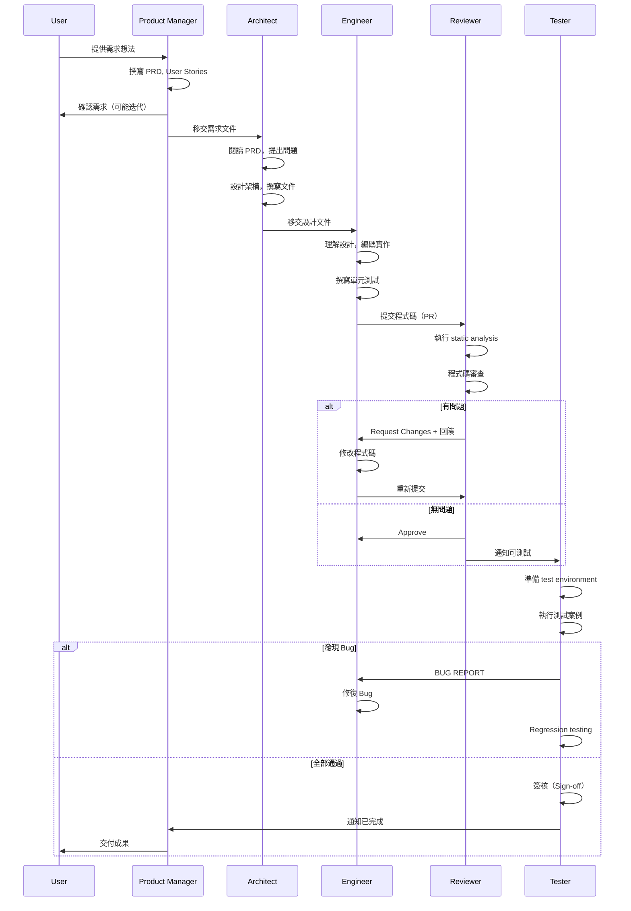

# Overall Workflow

## 序列流程



---

## 狀態轉換

```
[IN_PROGRESS] → [READY_FOR_REVIEW] → [IN_REVIEW] → [CHANGES_REQUESTED]
       ↓                                          ↑
       └──────────────── [APPROVED] ────────────┘
                              ↓
                       [TESTING] → [PASSED] / [FAILED]
                              ↓
                       [COMPLETED]
```

---

## 檔案傳遞協議

每個角色完成工作後，必須放置以下檔案到 `shared/` 目錄：

### Product Manager → Architect
```
shared/
└── pm-deliverables/
    ├── product-requirements.md
    ├── user-stories.md
    └── handoff.md  (含 open questions, assumptions)
```

### Architect → Engineer
```
shared/
└── architect-deliverables/
    ├── architecture.md
    ├── api-spec.yaml
    ├── data-model.md
    └── handoff.md
```

### Engineer → Reviewer
```
shared/
└── code/
    ├── src/ (所有程式碼)
    ├── tests/
    ├── README.md
    ├── package.json / requirements.txt
    └── TESTING.md (如何執行測試)
```

### Reviewer → Tester
```
shared/
└── reviewed-code/
    ├── (同 Engineer deliverables)
    ├── review-report.md
    └── approval-status: approved
```

### Tester → Product Manager
```
shared/
└── test-deliverables/
    ├── test-cases.md
    ├── test-execution-report.md
    ├── bugs/ (個別 bug report 檔案)
    └── sign-off.md (是否可 release)
```

---

## 通訊原則

- **檔案為主要通訊方式**：每個角色讀取上一個角色的輸出
- **日期時間命名**：`YYYY-MM-DD-filename.md` 便於追蹤版本
- **issues/qa.md**：每個角色可留下questions，由上一個角色回答
- **會議**：定期（每完成一個階段）開會討論，但非必要

---

## 狀態追蹤

建立一個 `STATUS.md` 在專案根目錄：

```markdown
| Role | Status | Deliverable | Last Updated |
|------|--------|------------|--------------|
| Product Manager | ✅ Completed | product-requirements.md | 2026-03-13 |
| Architect | 🔄 In Progress | architecture.md (70%) | 2026-03-13 |
| Engineer | ⏳ Pending | - | - |
| Reviewer | ⏳ Pending | - | - |
| Tester | ⏳ Pending | - | - |
```

---

_This workflow is in draft._
